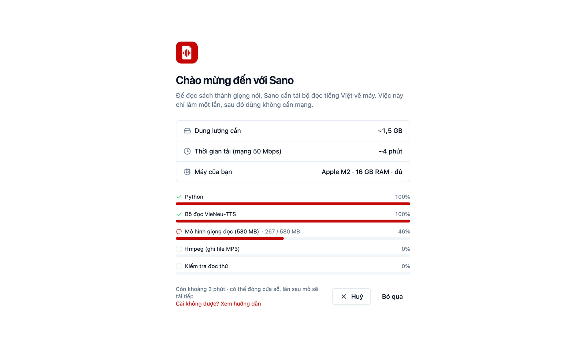

# Cài đặt Sano

Sano là phần mềm cài trên máy tính để tạo sách nói bằng AI từ file Word. Bản cài miễn phí, tải từ GitHub Releases. Lần mở đầu, Sano tự tải bộ đọc giọng Việt về máy; từ đó trở đi dùng được không cần mạng.

## Sano làm được gì

- **Tạo sách nói** từ tài liệu Word của chính bạn.
- **Nghe trên máy tính** ngay trong phần mềm, nhớ chỗ nghe dở.
- **Nghe trên điện thoại**: xuất một file M4B, nghe bằng app BookPlayer (miễn phí, có cho iPhone và Android). Xem [Nghe trên điện thoại](./nghe-tren-dien-thoai).
- **Nghe khi lái xe ô tô**: BookPlayer chạy trên CarPlay và Android Auto, chọn sách, chọn chương ngay trên màn hình xe. Xem [Nghe khi lái xe ô tô](./nghe-khi-lai-xe).
- **25 giọng đọc AI tiếng Việt**: nam, nữ, giọng Bắc, giọng Nam.

## Máy cần có

- **Windows 10/11** 64-bit, **macOS 10.13** trở lên (Apple Silicon hoặc Intel), hoặc **Linux x86_64** có WebKitGTK 4.1 (Ubuntu 22.04+, Debian 12+, Fedora 36+).
- Ổ đĩa trống khoảng **2,5 GB** lúc cài bộ đọc. Cài xong bộ đọc chiếm khoảng 1,5 GB, chưa tính sách bạn tạo.
- RAM từ 4 GB trở lên. Máy ít RAM hơn vẫn chạy được nhưng đọc chậm.
- Mạng internet cho lần cài bộ đọc đầu tiên (tải khoảng 1 GB).

## Tải bản cài

Vào [trang Releases](https://github.com/tanviet12/sano-sach-noi/releases/latest), chọn file đúng máy:

| Máy | File |
|---|---|
| Windows 10/11 | `Sano-<phiên bản>-windows-amd64-setup.exe` (bộ cài, không cần quyền quản trị) hoặc `…-portable.zip` (giải nén là chạy) |
| macOS | `Sano-<phiên bản>-macos-universal.dmg` |
| Linux | `Sano-<phiên bản>-linux-amd64.AppImage` |

## Cài theo hệ điều hành

**Windows:** chạy file `…-setup.exe`. Sano cài vào thư mục của người dùng (`%LOCALAPPDATA%\Programs\Sano`), không hỏi quyền quản trị. Bản `portable.zip` chỉ cần giải nén rồi mở `Sano.exe` (cần WebView2, Windows 11 có sẵn).

**macOS:** mở file `.dmg`, kéo biểu tượng Sano vào thư mục **Applications**.

**Linux:** cấp quyền chạy rồi mở file:

```bash
chmod +x Sano-*.AppImage
./Sano-*.AppImage
```

Thiếu WebKitGTK thì cài thêm: `sudo apt install libwebkit2gtk-4.1-0`.

::: warning Bản cài chưa ký số
Lần đầu mở, macOS và Windows sẽ cảnh báo vì Sano chưa mua chứng chỉ ký số. Xem [Mở app lần đầu khi chưa ký số](./mo-app-lan-dau) để mở an toàn.
:::

## Cài bộ đọc lần mở đầu

Chưa có bộ đọc, Sano mở màn **Chào mừng đến với Sano**. Màn này cho biết trước dung lượng cần, thời gian tải ước tính và cấu hình máy. Bấm **Cài bộ đọc**, Sano tự làm lần lượt:

1. Python
2. Bộ đọc VieNeu-TTS
3. Mô hình giọng đọc (khoảng 580 MB)
4. ffmpeg (ghi file MP3), bỏ qua nếu máy đã có
5. Kiểm tra đọc thử

Mỗi bước có thanh tiến độ. Mọi thứ tải về đều được ghim phiên bản và kiểm mã SHA256. Bấm **Huỷ** hoặc đóng cửa sổ giữa chừng cũng không sao: lần sau bấm **Cài tiếp**, Sano bỏ qua bước đã xong và tải tiếp phần dở. Lỗi thì màn hình báo rõ và có nút **Thử lại**.



Xong, bấm **Bắt đầu tạo sách**.

## Đồng ý điều khoản

Trước khi vào phần mềm, Sano hiện [Điều khoản sử dụng](./dieu-khoan-su-dung) một lần. Tick ô đồng ý rồi bấm **Đồng ý và bắt đầu**. Điều khoản có phiên bản mới thì Sano hỏi lại.

## Kiểm tra file tải về (không bắt buộc)

Mỗi bản phát hành kèm file `SHA256SUMS`. Đặt cùng thư mục với file cài rồi chạy:

```bash
sha256sum -c SHA256SUMS --ignore-missing      # Linux, Windows (Git Bash)
shasum -a 256 -c SHA256SUMS --ignore-missing  # macOS
```

Bản cài được build trên GitHub Actions từ mã nguồn công khai, không build tay.

Tiếp theo: [Tạo sách đầu tiên](./tao-sach-dau-tien).
