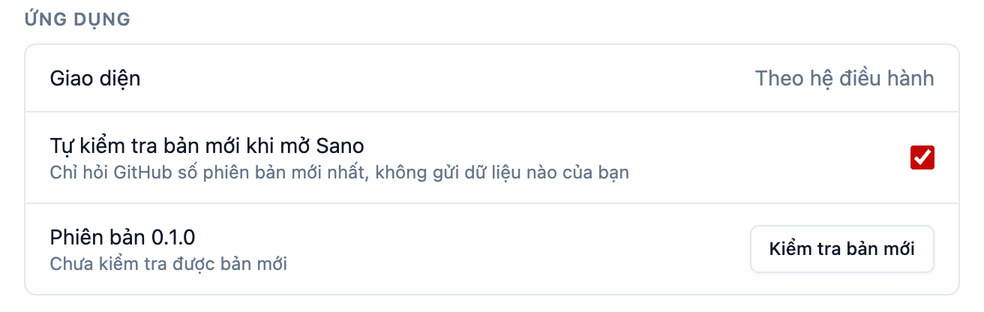

# Câu hỏi thường gặp

## Dùng Sano

### Sano có mất phí không?

Không. Sano miễn phí, mã nguồn mở theo giấy phép MIT. Không quảng cáo, không cần tài khoản, không đăng nhập.

### Có cần mạng internet không?

Chỉ cần lúc tải bản cài và lần cài bộ đọc đầu tiên (tải khoảng 1 GB). Sau đó tạo sách và nghe hoàn toàn không cần mạng.

Khi mở, Sano hỏi GitHub xem có bản mới không (chỉ lấy số phiên bản, không gửi dữ liệu nào của bạn). Không có mạng thì bỏ qua. Tắt được trong **Cài đặt → Tự kiểm tra bản mới khi mở Sano**.

### Cập nhật Sano thế nào?

Có bản mới, thanh bên hiện **Có bản mới**. Bấm vào để xem có gì mới, rồi **Mở trang tải** và cài đè lên bản đang dùng. Sách, tiến độ nghe và bộ đọc giữ nguyên.

### Tài liệu của tôi có bị gửi lên mạng không?

Không. Sano đọc file và tạo giọng nói ngay trên máy bạn, không có máy chủ nào nhận tài liệu. Chỉ khi bạn tự dùng ChatGPT, Gemini hay Claude để [làm mượt tài liệu](./lam-muot-tai-lieu) thì nội dung mới đi qua dịch vụ đó.

### Sano nhận file gì?

File Word `.docx`. Chưa nhận PDF. File `.doc` đời cũ thì mở bằng Word rồi lưu lại thành `.docx`. File có mật khẩu hoặc khoá bảo vệ bị từ chối.

### Làm sao để có mục lục chương?

Trong Word, đặt kiểu **Heading 1** cho tên chương, **Heading 2** cho tên mục. Chữ chỉ tô đậm, cỡ to mà không dùng kiểu Heading thì Sano không nhận là tiêu đề (và sẽ cảnh báo khi nạp file).

### Có bao nhiêu giọng đọc?

Khoảng 25 giọng Việt của bộ đọc [VieNeu-TTS](https://github.com/pnnbao97/VieNeu-TTS): nam, nữ, giọng Bắc, giọng Nam. Giọng mặc định là Thiện Minh. Nghe thử từng giọng ở bước **Giọng đọc** trước khi chọn.

### Tạo một cuốn mất bao lâu?

Tuỳ độ dài tài liệu và sức máy. Ở bước **Mục lục**, Sano ước tính thời gian render trên chính máy bạn. Việc render chạy nền, bạn vẫn dùng được phần khác trong lúc chờ.

### Bộ đọc đọc sai một từ, sửa thế nào?

Ở bước **Nghe thử**, sửa chữ trong ô **Lời đọc** (ví dụ viết tên nước ngoài theo cách đọc tiếng Việt) rồi bấm **Render lại đoạn này**. Số, chữ viết tắt thông dụng, mũi tên, ký hiệu Sano đã tự chuyển thành lời đọc.

### Nghe trên điện thoại được không?

Được. Xuất sách thành một file M4B rồi chép sang điện thoại, xem [Nghe trên điện thoại](./nghe-tren-dien-thoai).

### Có bản cho điện thoại, có nghe qua web không?

Bản hiện tại là phần mềm máy tính. Máy chủ nghe sách riêng (nghe qua web và app điện thoại) nằm trong kế hoạch giai đoạn sau.

## Bản quyền

### Tôi được làm sách nói từ những tài liệu nào?

Tài liệu của chính bạn, tác phẩm đã hết thời hạn bảo hộ, hoặc tác phẩm được tác giả, chủ sở hữu cho phép. Không làm sách nói từ sách còn bản quyền, kể cả để nghe riêng, khi chưa được phép. Xem [Điều khoản sử dụng](./dieu-khoan-su-dung).

### Tôi có được chia sẻ sách nói đã tạo không?

Sách nói làm từ một tác phẩm là tác phẩm phái sinh của tác phẩm đó. Chỉ chia sẻ khi bạn là tác giả, hoặc có sự đồng ý của chủ sở hữu.

## Sự cố

### Cài bộ đọc bị dừng giữa chừng

Mở lại Sano, bấm **Cài tiếp**: Sano bỏ qua bước đã xong và tải tiếp phần dở. Kiểm tra mạng và ổ đĩa còn trống khoảng 2,5 GB. Lỗi lặp lại thì bấm **Thử lại** và ghi lại thông báo lỗi khi [báo lỗi](https://github.com/tanviet12/sano-sach-noi/issues).

### Máy báo không mở được Sano

Bản cài chưa ký số, xem [Mở app lần đầu khi chưa ký số](./mo-app-lan-dau).

### Kiểm tra bộ đọc còn chạy tốt không?

**Cài đặt** → **Bộ đọc** → **Chạy kiểm tra**.

### Tôi muốn báo lỗi hoặc góp ý

Mở một issue trên [GitHub](https://github.com/tanviet12/sano-sach-noi/issues), ghi hệ điều hành, phiên bản Sano (xem ở mục Giới thiệu) và các bước gây lỗi.
