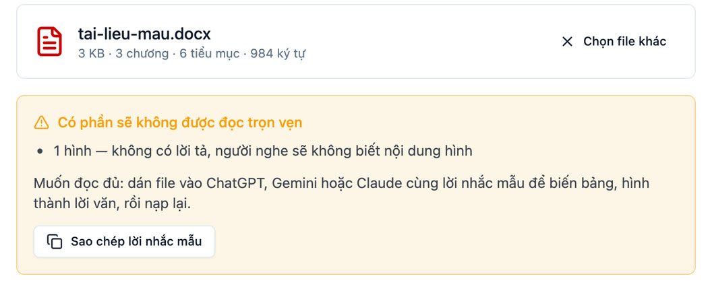

# Làm mượt tài liệu trước khi tạo sách nói

Sano đọc được file Word thường. Nhưng một số thứ trong tài liệu viết để **nhìn** chứ không để **nghe**: bảng, hình, sơ đồ, danh sách gạch đầu dòng, câu kiểu "xem hình bên dưới". Sano sẽ cảnh báo khi nạp file nếu gặp những thứ này.

Cách xử lý nhanh nhất: nhờ một trợ lý AI bất kỳ (ChatGPT, Gemini, Claude…) viết lại thành bản để đọc to, rồi nạp bản đó vào Sano. Không cần tài khoản trả phí.

## Các bước

1. Mở ChatGPT, Gemini hoặc Claude trên trình duyệt.
2. Đính kèm file Word (hoặc dán nội dung vào khung chat).
3. Dán **lời nhắc mẫu** ở cuối trang này rồi gửi. Trong phần mềm Sano, bước "Nạp file" có sẵn nút **Sao chép lời nhắc mẫu**.
4. Tài liệu dài: AI sẽ làm từng chương, gõ "tiếp" để làm phần sau.
5. Chép kết quả vào một file Word mới.
6. Đặt kiểu chữ cho tiêu đề: dòng bắt đầu bằng `#` đặt **Heading 1** (chương), dòng bắt đầu bằng `##` đặt **Heading 2** (mục), rồi xoá các dấu `#`. Sano dựa vào Heading 1 và Heading 2 để làm mục lục.
7. Nạp file mới vào Sano, nghe thử vài đoạn trước khi tạo cả cuốn.

## Lưu ý

- Đọc lại bản AI viết, nhất là số liệu và tên riêng. AI đôi khi tóm tắt hoặc tự thêm ý dù đã dặn.
- Tài liệu riêng tư hoặc nhạy cảm: cân nhắc trước khi gửi lên dịch vụ AI trên mạng.

## Lời nhắc mẫu

Nội dung đầy đủ ở file [`prompts/loi-nhac-mau.txt`](prompts/loi-nhac-mau.txt). Phần mềm Sano dùng đúng file này.

<<< @/prompts/loi-nhac-mau.txt{txt}
