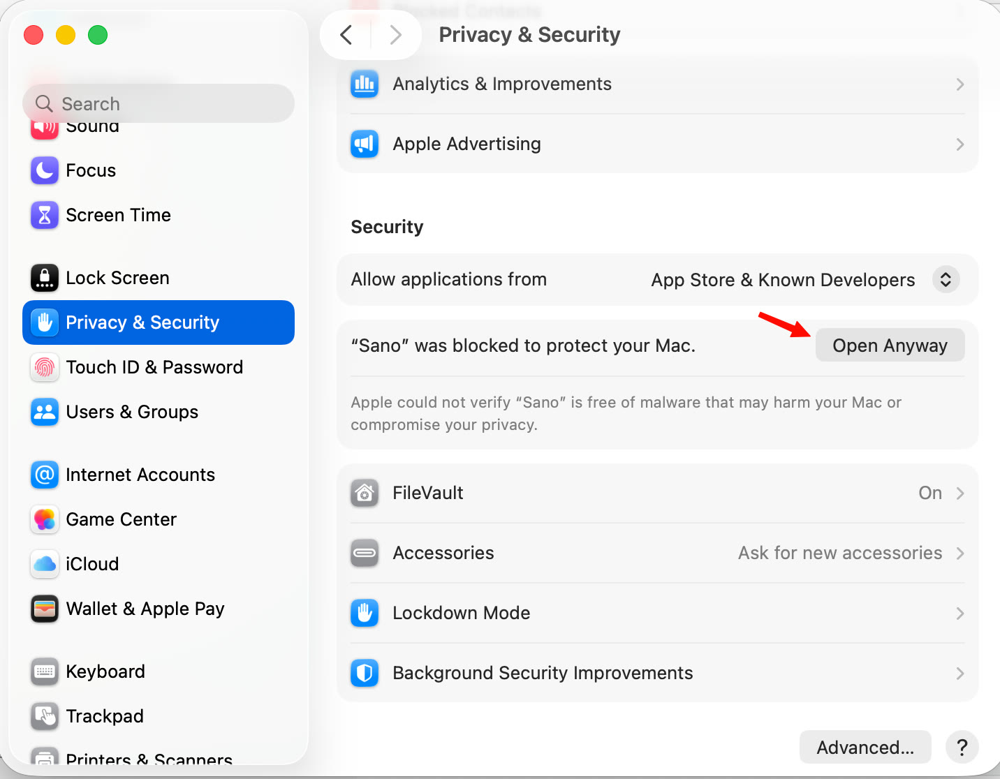

# Mở app lần đầu khi chưa ký số

Sano chưa mua chứng chỉ ký số của Apple và Microsoft, nên lần đầu mở, hệ điều hành cảnh báo "không xác minh được nhà phát triển". Đây là cảnh báo chung cho mọi phần mềm chưa ký số, không phải Sano có lỗi. Chỉ cần làm một lần.

::: tip Chỉ tải từ nguồn chính thức
Tải Sano từ [GitHub Releases của dự án](https://github.com/tanviet12/sano-sach-noi/releases/latest). Muốn chắc file không bị sửa, đối chiếu mã SHA256 với file `SHA256SUMS` đi kèm (xem [Cài đặt](./cai-dat#kiem-tra-file-tai-ve-khong-bat-buoc)).
:::

## macOS

1. Mở Sano trong thư mục Applications. macOS báo không mở được vì không xác minh được nhà phát triển → bấm **Xong** (**Done**) hoặc **OK**.
2. Mở **Cài đặt hệ thống** (**System Settings**) → **Quyền riêng tư & Bảo mật** (**Privacy & Security**).
3. Kéo xuống mục **Bảo mật** (**Security**), thấy dòng "Sano" bị chặn để bảo vệ máy (*"Sano" was blocked to protect your Mac*) → bấm **Vẫn mở** (**Open Anyway**).

   

4. Nhập mật khẩu máy hoặc dùng Touch ID nếu được hỏi, rồi bấm **Mở** (**Open**) ở hộp xác nhận.

Lần sau mở Sano bình thường, không hỏi lại.

## Windows

1. Chạy file cài. Màn hình xanh **Windows đã bảo vệ PC của bạn** (SmartScreen) hiện ra.
2. Bấm **Thông tin thêm**.
3. Bấm **Vẫn chạy**.

Phần mềm diệt virus có thể hỏi thêm vì file mới, ít người tải. Bản cài Sano không nén UPX để tránh bị báo nhầm.

## Linux

Không có cảnh báo ký số. Cấp quyền chạy cho file AppImage rồi mở:

```bash
chmod +x Sano-*.AppImage
./Sano-*.AppImage
```
