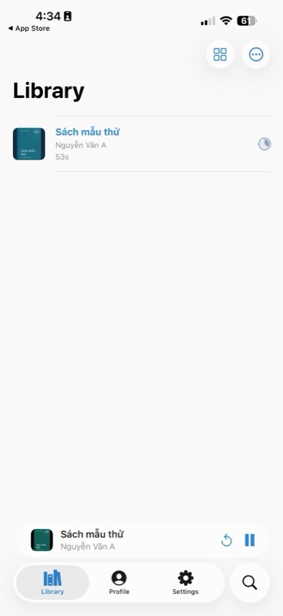
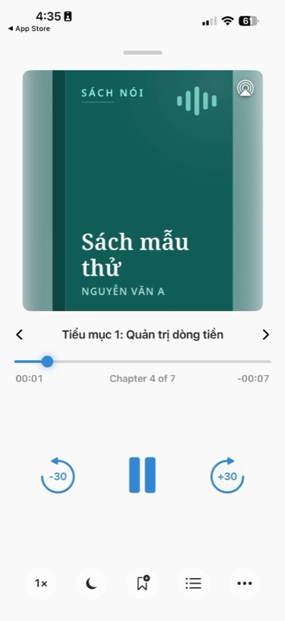
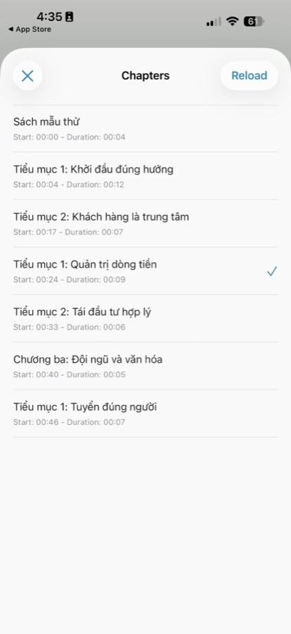
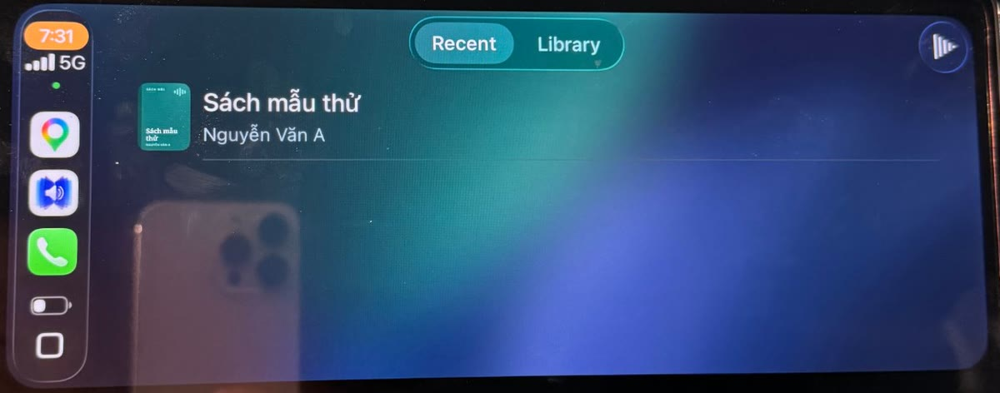
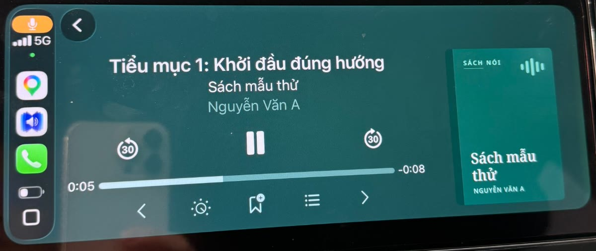
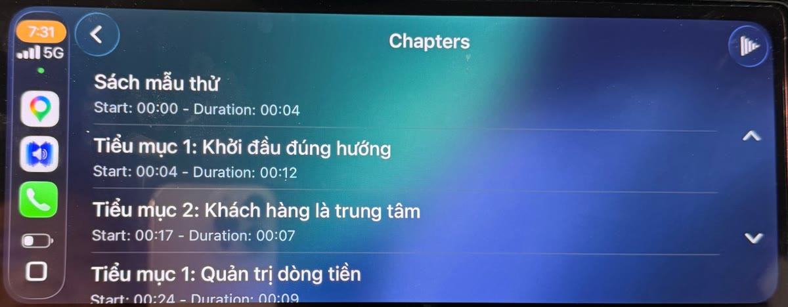

# Nghe trên điện thoại, trên xe

Sano xuất cả cuốn thành **một file `.m4b`**: có mục lục chương, tên sách, tác giả và ảnh bìa. Chép file này vào điện thoại là nghe được bằng app sách nói, không cần mạng, không cần máy chủ. App nghe tự nhớ chỗ đang nghe dở; trên xe (CarPlay, Android Auto) màn hình hiện tên sách và tên chương.

## Xuất file M4B

Mở cuốn sách trong **Thư viện** → **Xuất M4B** (hoặc **Xuất file M4B** ngay khi render xong) → chọn nơi lưu (mặc định thư mục Tải về). Xong, Sano mở thư mục và chọn sẵn file. Chi tiết ở [Xuất M4B và gói zip](./xuat-m4b-goi-zip).

::: tip Mẹo
Dung lượng khoảng **29 MB cho mỗi giờ nghe** (AAC 64 kbps), đủ rõ cho giọng đọc.
:::

Dùng dòng lệnh:

```bash
sano-docx2tts --m4b-from-dir ~/Sano/Sach/<tên-thư-mục> --m4b ~/Downloads/sach.m4b
```

## iPhone, iPad

::: warning Lưu ý
App **Sách** (Apple Books) trên iPhone **không nhận file `.m4b` gửi qua AirDrop hay app Tệp** (đường đó chỉ nhận PDF, EPUB). Dùng một trong hai cách dưới đây.
:::

### Cách nhanh: BookPlayer

Không cần cắm máy:

1. Cài **BookPlayer** từ App Store (miễn phí, mã nguồn mở).
2. Đưa file `.m4b` vào iPhone: **AirDrop** từ Mac (file lưu vào app **Tệp**), hoặc tải lên iCloud Drive / Google Drive.
3. Mở BookPlayer → bấm **+** → **Import files** (nhập tệp) → chọn file `.m4b` trong Tệp.

BookPlayer hiện bìa, mục lục chương, nhớ chỗ nghe dở, chỉnh tốc độ, hẹn giờ tắt, có **CarPlay**.

<div class="phone-shots">
  
  
  
</div>

*Thư viện · Đang nghe (bìa, tên chương, tốc độ, hẹn giờ tắt) · Mục lục chương lấy từ file M4B do Sano xuất. Bấm ảnh để phóng to.*

### Trên xe có CarPlay

BookPlayer chạy được trên màn hình xe qua **CarPlay**, không chỉ phát/dừng như trình phát nhạc:

1. Kết nối iPhone với xe (cáp USB hoặc CarPlay không dây), mở **BookPlayer** trên màn hình xe.
2. Chọn sách ở tab **Recent** (nghe gần đây) hoặc **Library** (cả thư viện).
3. Màn đang nghe hiện tên chương, tên sách, tác giả và bìa; có nút lùi/tới 30 giây, sang chương trước/sau, đổi tốc độ, đánh dấu.
4. Bấm nút danh sách để mở **Chapters**: toàn bộ chương lấy từ mục lục trong file M4B, kèm thời điểm bắt đầu và độ dài. Chạm vào chương nào là nghe chương đó.

BookPlayer nhớ chỗ nghe dở: tắt máy xe, lần sau mở lại nghe tiếp đúng chỗ, trên xe hay trên điện thoại đều vậy.





*Chụp trên xe thật: chọn sách · đang nghe · chọn chương. Sách mẫu do Sano tạo, xuất M4B.*

### App Sách của Apple

Đồng bộ từ máy tính:

1. **Mac (macOS 10.15 trở lên):** cắm iPhone vào Mac → mở Finder, chọn iPhone ở thanh bên → tab **Sách nói** → kéo file `.m4b` vào → **Đồng bộ**.
2. **Windows:** dùng app **Apple Devices** (hoặc iTunes bản cũ): thêm file `.m4b` vào mục Sách nói rồi đồng bộ sang iPhone.

Sách hiện trong app Sách, mục **Sách nói**; trên xe có CarPlay thì mở app Sách trên màn hình xe, chuyển chương bằng nút tới/lùi.

Trên máy Mac, mở file `.m4b` bằng app Sách là nghe được ngay.

## Android

1. Cài **BookPlayer** từ [Google Play](https://play.google.com/store/apps/details?id=com.tortugapower.audiobookplayer) (miễn phí, mã nguồn mở), cùng app như trên iPhone.
2. Chép file `.m4b` vào điện thoại: cắm cáp USB (chọn chế độ *Truyền tệp*) rồi chép vào một thư mục riêng, ví dụ `Audiobooks/`; hoặc tải lên Google Drive rồi tải về máy.
3. Mở BookPlayer, thêm sách bằng cách chọn file hoặc cả thư mục `Audiobooks/`; hoặc từ app Tệp / Drive, bấm **Chia sẻ** file `.m4b` rồi chọn BookPlayer.

BookPlayer hiện bìa, mục lục chương, nhớ chỗ nghe dở, chỉnh tốc độ, hẹn giờ tắt.

Trên xe có **Android Auto**: BookPlayer chạy trên màn hình xe, chọn sách và chọn chương giống CarPlay ở trên.

Muốn dùng app khác: **Voice** (miễn phí, mã nguồn mở) cũng đọc được M4B và mục lục chương.

Cả iPhone và Android đều mở được bằng **VLC** (miễn phí, hiện chương), nhưng VLC không nhớ chỗ nghe dở như app sách nói.

## Nếu có trục trặc

::: info Không thấy mục lục chương?
Một số trình phát nhạc thông thường không đọc mục lục của sách nói. Dùng app sách nói như ở trên.
:::

- **Không thấy bìa:** app có thể lưu bộ nhớ đệm bìa cũ; xoá sách khỏi app rồi thêm lại.
- **Muốn file nhỏ hơn:** xuất bằng dòng lệnh với `--m4b-bitrate 48k` (giọng đọc vẫn nghe rõ).
