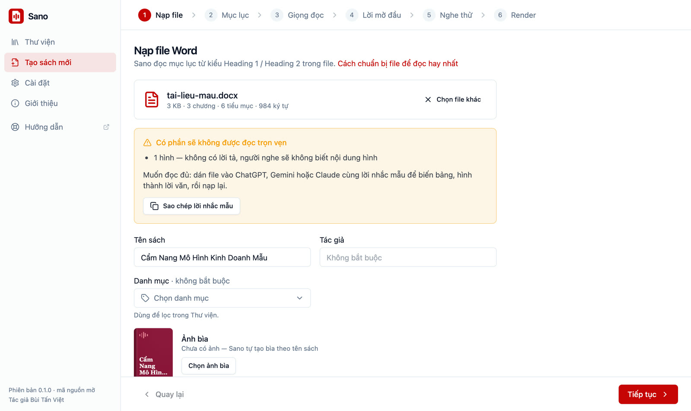
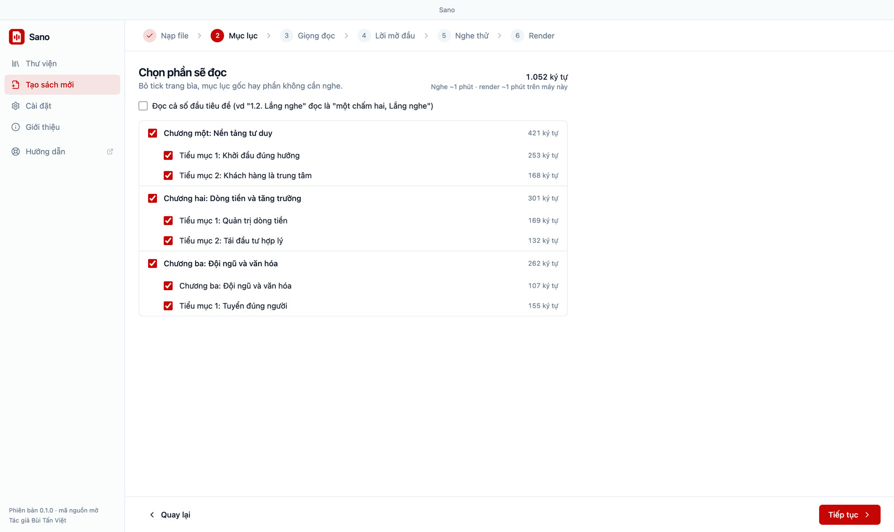
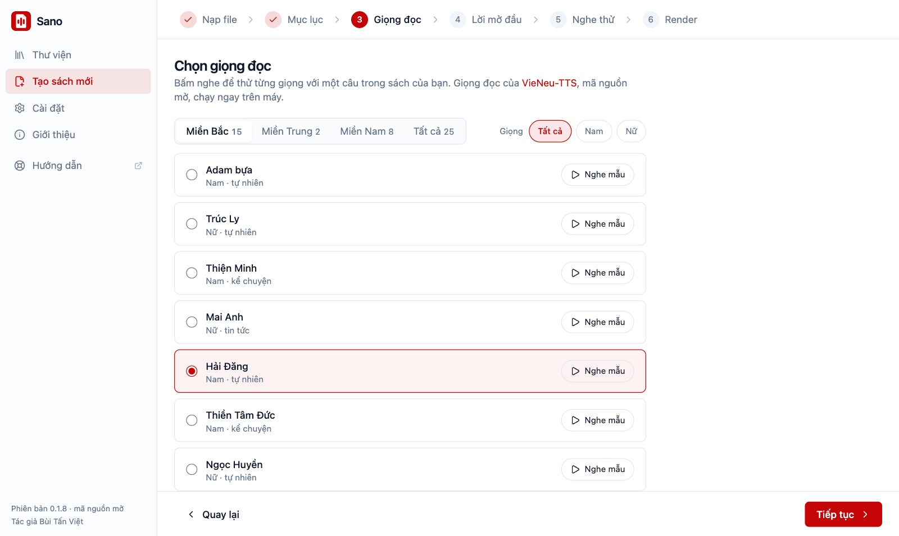
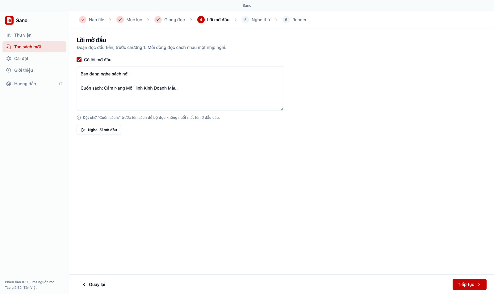
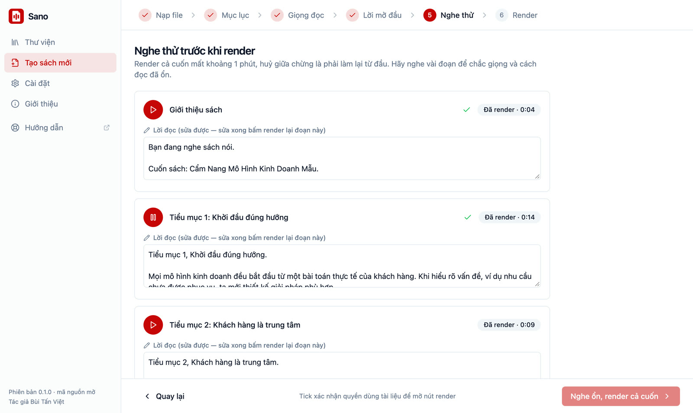
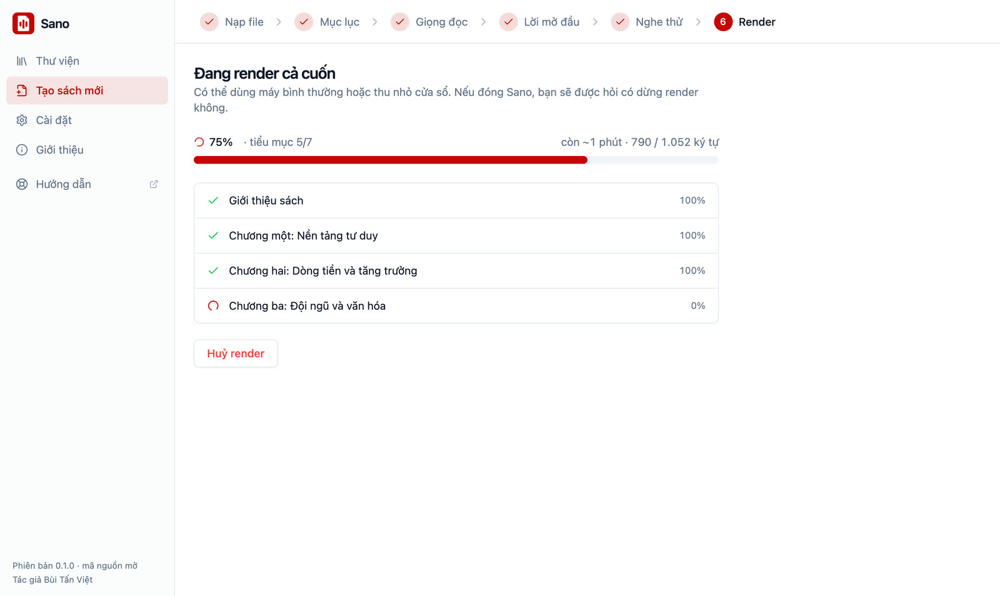

# Cách làm sách nói bằng AI từ file Word

Trong Sano, bấm **Tạo sách mới**. Việc tạo sách gồm 6 bước: **Nạp file** → **Mục lục** → **Giọng đọc** → **Lời mở đầu** → **Nghe thử** → **Render**. Giọng đọc AI chạy ngay trên máy bạn, tài liệu không gửi đi đâu.

::: tip Chuẩn bị file Word
Sano chỉ nhận file `.docx`. Đặt kiểu **Heading 1** cho tên chương và **Heading 2** cho tên mục, Sano dựa vào đó để làm mục lục. Tài liệu có nhiều bảng, hình, sơ đồ thì nên [làm mượt tài liệu](./lam-muot-tai-lieu) trước.
:::

## Chuẩn bị file Word {#chuan-bi-file}

Sano làm mục lục dựa vào **kiểu chữ của tiêu đề**: mỗi chương đặt kiểu **Heading 1**, mỗi mục trong chương đặt kiểu **Heading 2**. Chữ in đậm hay chữ to không lên mục lục. Trong Word: bôi đen dòng tiêu đề → thẻ **Trang chủ** → chọn **Heading 1** hoặc **Heading 2** trong ô Kiểu. Trong Google Docs: **Định dạng** → **Kiểu đoạn văn** → **Tiêu đề 1** / **Tiêu đề 2**, rồi tải về dạng `.docx`.

Cách nhanh nhất là làm theo **file Word mẫu**: đã đặt sẵn đúng kiểu tiêu đề, bên trong có lời hướng dẫn. Mở bằng Word, xoá phần hướng dẫn, dán nội dung của bạn vào. Nạp ngay file mẫu vào Sano cũng tạo được sách để thử.

<a class="sano-btn outline" href="/sano-sach-noi/mau/Mau-sach-noi-Sano.docx" download>Tải file Word mẫu (.docx)</a>

Trong phần mềm, bước **Nạp file** cũng có nút **Tải file Word mẫu**. Tài liệu có bảng, hình, danh sách: xem thêm [Làm mượt tài liệu](./lam-muot-tai-lieu).

## 1. Nạp file

Kéo file `.docx` vào ô **Kéo file .docx vào đây**, hoặc bấm vào ô để chọn file. Muốn thử trước thì bấm **Thử với tài liệu mẫu** (nạp thẳng file Word mẫu), hoặc **Tải file Word mẫu** để lưu về máy làm theo.

Sano đọc file rồi cho biết số chương, số tiểu mục, số ký tự. Nếu gặp phần sẽ không được đọc trọn vẹn, Sano hiện cảnh báo:

- bảng (sẽ đọc phẳng từng ô),
- hình (không có lời tả),
- đoạn chữ to đậm trông như tiêu đề nhưng không dùng kiểu Heading,
- chữ viết tắt chưa có cách đọc.

Cạnh cảnh báo có nút **Sao chép lời nhắc mẫu** để nhờ ChatGPT, Gemini hoặc Claude viết lại tài liệu thành bản dễ nghe.

Điền **Tên sách** (bắt buộc), **Tác giả** và **Danh mục** (không bắt buộc). **Ảnh bìa** nhận jpg, png, webp tối đa 10 MB; không chọn thì Sano tự tạo bìa theo tên sách.

::: info File có mật khẩu
File Word có mật khẩu hoặc khoá bảo vệ sẽ bị từ chối. Sano không có tính năng gỡ khoá.
:::

## 2. Mục lục

Tick hoặc bỏ tick từng chương, từng mục để chọn phần sẽ đọc. Trang mục lục gốc trong file được bỏ tick sẵn. Sano ước tính thời lượng nghe và thời gian render trên máy của bạn.

Số đầu tiêu đề (như "1.2.") mặc định không đọc. Muốn đọc thì tick ô **Đọc cả số đầu tiêu đề**.

## 3. Giọng đọc

Chọn một trong khoảng 25 giọng Việt, nam và nữ, giọng Bắc và giọng Nam. Mỗi giọng có nút **Nghe mẫu**; câu nghe mẫu sửa được. Giọng mặc định là **Thiện Minh** (nam, miền Bắc, giọng kể chuyện).

## 4. Lời mở đầu

Sano tự điền lời mở đầu đọc trước chương 1, ví dụ:

> Bạn đang nghe sách nói. Cuốn sách: Kỹ năng mềm cho người trẻ. Tác giả: …

Sửa được, hoặc bỏ tick **Có lời mở đầu** nếu không cần. Giữ chữ "Cuốn sách:" trước tên sách để bộ đọc không nuốt mất tên ở đầu câu. Bấm **Nghe lời mở đầu** để nghe thử.

## 5. Nghe thử

Sano tự đọc lời mở đầu và 2 mục đầu tiên (mỗi đoạn khoảng 500 ký tự đầu). Lần đầu mất khoảng nửa phút để nạp bộ đọc.

- Nghe thử không bắt buộc, nhưng nên nghe vài đoạn để chắc giọng và cách đọc đã ổn.
- Chỗ nào đọc chưa đúng (tên riêng, từ nước ngoài, chữ viết tắt), sửa trong ô **Lời đọc** rồi bấm **Render lại đoạn này**. Bản cuối dùng đúng lời bạn đã sửa.
- Muốn nghe thêm phần khác: chọn trong **Chọn thêm đoạn khác để nghe thử**.

Cuối bước, tick ô xác nhận bạn có quyền dùng tài liệu này (tài liệu của bạn, tác phẩm đã hết thời hạn bảo hộ, hoặc được tác giả cho phép), rồi bấm **Nghe ổn, render cả cuốn**.

## 6. Render

Sano đọc cả cuốn và chạy nền: màn hình hiện phần trăm, số mục đã xong, thời gian còn lại. Bạn vẫn dùng được phần khác của Sano trong lúc chờ; thanh bên luôn có thẻ **Đang render**. Mỗi lúc render một cuốn.

- **Huỷ render**: không lưu gì, quay về bước Nghe thử.
- Đóng cửa sổ khi đang render, Sano hỏi **Dừng render và thoát** hay **Tiếp tục render**.

Xong, sách tự vào [Thư viện](./thu-vien). Các nút ngay sau đó: **Nghe ngay**, **Xuất file M4B** (để [nghe trên điện thoại](./nghe-tren-dien-thoai)), **Xuất gói zip**, **Mở thư mục**, **Tạo cuốn khác**.

## Nghe thử một cuốn Sano đã tạo

Trang chủ có [trình phát nghe thử](/#nghe-thu) một cuốn sách mẫu tạo đúng theo các bước trên, giọng Thiện Minh.
