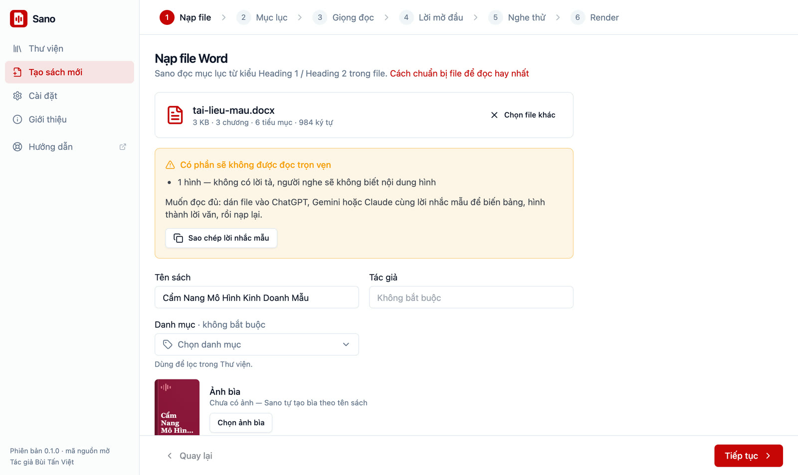
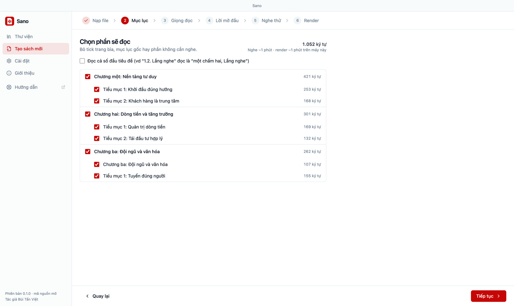
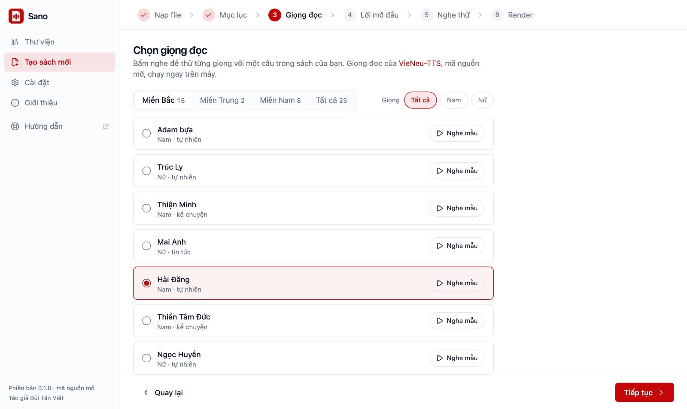
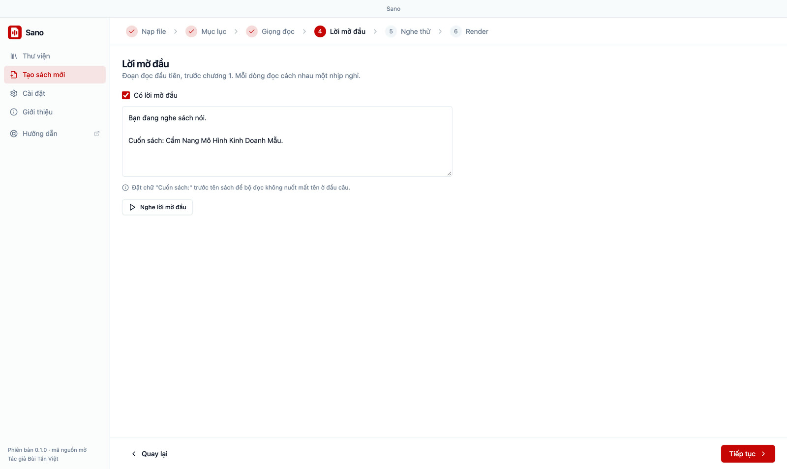
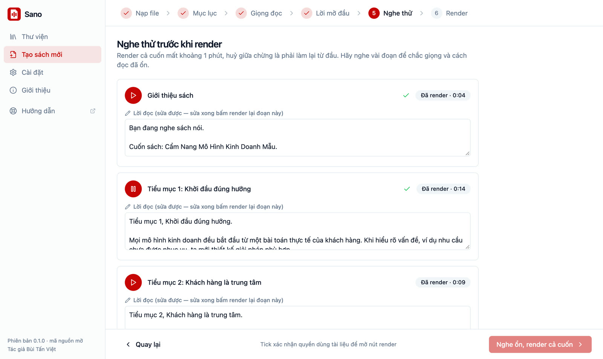
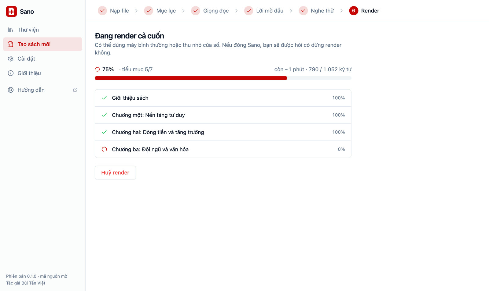

# Cách làm sách nói bằng AI từ file Word

Trong Sano, bấm **Tạo sách nói**. Việc tạo sách gồm 7 bước: **Cách đọc** → **Nạp file** → **Mục lục** → **Giọng đọc** → **Lời mở đầu** → **Nghe thử** → **Render**. Giọng đọc AI chạy ngay trên máy bạn, tài liệu không gửi đi đâu.

::: tip Chuẩn bị file Word
Sano nhận file Word `.docx` và sách điện tử `.epub`. Với file Word, đặt kiểu **Heading 1** cho tên chương và **Heading 2** cho tên mục, Sano dựa vào đó để làm mục lục. Tài liệu có nhiều bảng, hình, sơ đồ, hoặc muốn nghe cuốn hơn, chọn cấp 2 hay cấp 3 ở bước [Cách đọc](./lam-muot-tai-lieu).
:::

## Chuẩn bị file Word {#chuan-bi-file}

Sano làm mục lục dựa vào **kiểu chữ của tiêu đề**: mỗi chương đặt kiểu **Heading 1**, mỗi mục trong chương đặt kiểu **Heading 2**. Chữ in đậm hay chữ to không lên mục lục. Trong Word: bôi đen dòng tiêu đề → thẻ **Trang chủ** → chọn **Heading 1** hoặc **Heading 2** trong ô Kiểu. Trong Google Docs: **Định dạng** → **Kiểu đoạn văn** → **Tiêu đề 1** / **Tiêu đề 2**, rồi tải về dạng `.docx`.

Cách nhanh nhất là làm theo **file Word mẫu**: đã đặt sẵn đúng kiểu tiêu đề, bên trong có lời hướng dẫn. Mở bằng Word, xoá phần hướng dẫn, dán nội dung của bạn vào. Nạp ngay file mẫu vào Sano cũng tạo được sách để thử.

<a class="sano-btn outline" href="/mau/Mau-sach-noi-Sano.docx" download>Tải file Word mẫu (.docx)</a>

Trong phần mềm, bước **Nạp file** cũng có nút **Tải file Word mẫu**. Tài liệu có bảng, hình, danh sách: xem thêm [Ba cách đọc](./lam-muot-tai-lieu).

### Sách điện tử EPUB {#epub}

File `.epub` không cần chuẩn bị gì: Sano lấy tên sách và mục lục có sẵn trong sách, mỗi chương thành một chương của sách nói. Trang bìa, trang mục lục, chú thích cuối trang không được đọc. Sách có DRM (mua trên các cửa hàng có khoá chống sao chép) bị từ chối. Sách chỉ có hình như truyện tranh thì không có chữ để đọc.

## 1. Cách đọc

Chọn một trong ba cấp: **Đọc nguyên văn** (Sano đọc đúng từng chữ, chọn sẵn lần đầu), **Làm mượt** (nhờ AI đổi bảng, hình, danh sách thành lời, giữ nguyên ý), hoặc **Viết lại thành văn sách nói** (nhờ AI viết lại như người kể, nghe hấp dẫn nhất). Mỗi cấp có nút **Nghe mẫu**. Chọn cấp 2 hoặc 3, Sano hướng dẫn 3 bước nhờ Claude, ChatGPT hoặc Gemini, có sẵn prompt để sao chép. Chi tiết ở trang [Ba cách đọc](./lam-muot-tai-lieu).

## 2. Nạp file

Kéo file `.docx` hoặc `.epub` vào ô **Kéo file .docx hoặc .epub vào đây**, hoặc bấm vào ô để chọn file. Muốn thử trước thì bấm **Thử với tài liệu mẫu** (nạp thẳng file Word mẫu), hoặc **Tải file Word mẫu** để lưu về máy làm theo.

Sano đọc file rồi cho biết số chương, số tiểu mục, số ký tự. Nếu gặp phần sẽ không được đọc trọn vẹn, Sano hiện cảnh báo:

- bảng (sẽ đọc phẳng từng ô),
- hình (không có lời tả),
- đoạn chữ to đậm trông như tiêu đề nhưng không dùng kiểu Heading,
- chữ viết tắt chưa có cách đọc.

Muốn đọc đủ phần này, chọn cấp 2 **Làm mượt** ở bước Cách đọc. Đã chọn cấp 2 hoặc 3 thì nạp file AI tạo, hoặc bấm **Dán văn bản AI trả về** nếu AI không tạo được file Word (như Gemini bản miễn phí).

Điền **Tên sách** (bắt buộc), **Tác giả** và **Danh mục** (không bắt buộc). **Ảnh bìa** nhận jpg, png, webp tối đa 10 MB; không chọn thì Sano tự tạo bìa theo tên sách.

::: info File có mật khẩu
File Word có mật khẩu hoặc khoá bảo vệ sẽ bị từ chối. Sano không có tính năng gỡ khoá.
:::

## 3. Mục lục

Tick hoặc bỏ tick từng chương, từng mục để chọn phần sẽ đọc. Trang mục lục gốc trong file được bỏ tick sẵn. Sano ước tính thời lượng nghe và thời gian render trên máy của bạn.

Số đầu tiêu đề (như "1.2.") mặc định không đọc. Muốn đọc thì tick ô **Đọc cả số đầu tiêu đề**.

## 4. Giọng đọc

Chọn một trong 25 giọng Việt. Giọng gom theo miền: **Miền Bắc** (15), **Miền Trung** (2), **Miền Nam** (8) hoặc **Tất cả**, lọc thêm giọng **Nam** / **Nữ**. Sano mở sẵn đúng miền bạn chọn lần trước, giọng của cuốn tạo gần nhất có nhãn **Dùng lần trước**. Mỗi giọng có nút **Nghe mẫu**; câu nghe mẫu sửa được. Giọng mặc định là **Hải Đăng** (nam, miền Bắc, giọng tự nhiên).

## 5. Lời mở đầu

Sano tự điền lời mở đầu đọc trước chương 1, ví dụ:

> Bạn đang nghe sách nói. Cuốn sách: Kỹ năng mềm cho người trẻ. Tác giả: …

Sửa được, hoặc bỏ tick **Có lời mở đầu** nếu không cần. Giữ chữ "Cuốn sách:" trước tên sách để bộ đọc không nuốt mất tên ở đầu câu. Bấm **Nghe lời mở đầu** để nghe thử.

## 6. Nghe thử

Sano tự đọc lời mở đầu và 2 mục đầu tiên (mỗi đoạn khoảng 500 ký tự đầu). Lần đầu mất khoảng nửa phút để nạp bộ đọc.

- Nghe thử không bắt buộc, nhưng nên nghe vài đoạn để chắc giọng và cách đọc đã ổn.
- Chỗ nào đọc chưa đúng (tên riêng, từ nước ngoài, chữ viết tắt), sửa trong ô **Lời đọc** rồi bấm **Render lại đoạn này**. Bản cuối dùng đúng lời bạn đã sửa.
- Muốn nghe thêm phần khác: chọn trong **Chọn thêm đoạn khác để nghe thử**.

Cuối bước, bấm **Nghe ổn, render cả cuốn**. Lần đầu render một tài liệu, Sano hiện bảng cam kết: bạn có quyền dùng tài liệu (tài liệu của bạn, tác phẩm đã hết thời hạn bảo hộ, hoặc được tác giả cho phép bằng văn bản), nội dung không vi phạm pháp luật, không mạo danh, không phát tán tác phẩm của người khác và tự chịu trách nhiệm. Tick đủ từng ô rồi bấm **Cam kết và render**.

## 7. Render

Sano đọc cả cuốn và chạy nền: màn hình hiện phần trăm, số mục đã xong, thời gian còn lại. Bạn vẫn dùng được phần khác của Sano trong lúc chờ; thanh bên luôn có thẻ **Đang render**. Mỗi lúc render một cuốn.

- **Huỷ render**: không lưu gì, quay về bước Nghe thử.
- Đóng cửa sổ khi đang render, Sano hỏi **Dừng render và thoát** hay **Tiếp tục render**.

Xong, sách tự vào [Thư viện](./thu-vien). Các nút ngay sau đó: **Nghe ngay**, **Nghe trên điện thoại** (tạo file M4B, xem [nghe trên điện thoại](./nghe-tren-dien-thoai)), **Xuất gói zip**, **Mở thư mục**, **Tạo cuốn khác**.

## Nghe thử một cuốn Sano đã tạo

Trang chủ có [trình phát nghe thử](/#nghe-thu) một cuốn sách mẫu tạo đúng theo các bước trên, giọng Hải Đăng.
