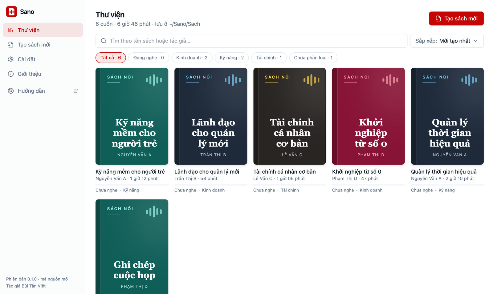

# Thư viện & danh mục

Mọi cuốn sách nói bạn tạo bằng Sano nằm trong **Thư viện**. Đầu trang cho biết số cuốn, tổng thời lượng và nơi lưu (`~/Sano/Sach`, bấm vào để mở thư mục).

## Nghe tiếp và tất cả sách

- Hàng **Nghe tiếp** hiện tối đa 3 cuốn đang nghe dở, bấm là phát tiếp.
- Mục **Tất cả sách** hiện bìa từng cuốn kèm tên, tác giả, thời lượng và tiến độ: "Chưa nghe", "Đã nghe X%" hoặc "Đã nghe xong".

## Tìm và sắp xếp

- Ô **Tìm theo tên sách hoặc tác giả…** tìm được cả khi gõ không dấu.
- **Sắp xếp:** Mới tạo nhất, Nghe gần đây, Tên A–Z, Tác giả A–Z, Dài nhất. Sano nhớ lựa chọn của bạn.

## Danh mục

Danh mục là nhãn bạn tự đặt cho mỗi cuốn (tối đa 40 ký tự), dùng để lọc thư viện.

- **Gắn danh mục:** chọn ở bước Nạp file khi tạo sách, hoặc trong **Sửa thông tin** của cuốn đã có. Chưa có danh mục phù hợp thì bấm **Tạo danh mục mới**, gõ tên rồi bấm **Thêm**.
- **Lọc:** khi thư viện có từ 2 danh mục, phía trên lưới bìa hiện các nút lọc: Tất cả, Đang nghe, từng danh mục, Chưa phân loại.
- Danh mục tự biến mất khi không còn cuốn nào dùng. Muốn đổi danh mục của một cuốn thì sửa thông tin cuốn đó.

## Sửa thông tin, mở thư mục, xoá

Bấm nút **⋯** trên bìa sách:

- **Sửa thông tin**: đổi **Tên sách**, **Tác giả**, **Danh mục**. Chỉ đổi phần hiển thị và gói zip; lời mở đầu đã đọc giữ nguyên, muốn đọc tên mới thì tạo lại sách.
- **Mở thư mục**: mở thư mục chứa file của cuốn sách.
- **Chuyển vào Thùng rác**: Sano hỏi lại rồi chuyển cả thư mục sách vào Thùng rác của máy, lấy lại được nếu xoá nhầm.

## Trình phát

Bấm vào một cuốn để nghe ngay trong Sano:

- Phát, dừng, lùi 15 giây, tới 30 giây, mục trước, mục sau; bấm vào thanh tiến độ để nhảy tới chỗ bất kỳ.
- Tốc độ 0,75× đến 2×, Sano nhớ tốc độ bạn chọn.
- Tự nhớ chỗ nghe dở của từng cuốn, hết mục tự sang mục kế.
- Cột **Mục lục** liệt kê từng mục, bấm để nhảy tới.
- Hàng nút: **Xuất M4B**, **Xuất gói zip**, **Mở thư mục**, **Xoá**.

## Sách lưu ở đâu

Mỗi cuốn là một thư mục trong `~/Sano/Sach/<tên-sách>/`:

| File | Là gì |
|---|---|
| `ch01-sec01.mp3`, `ch02-sec01.mp3`… | Audio từng mục (`ch01-sec01` là lời mở đầu) |
| `ch01-sec01.txt`… | Lời đọc đúng như bộ đọc đã đọc, để soát lại khi cần |
| `cover.png` (hoặc ảnh bìa bạn chọn) | Bìa sách |
| `metadata.json` | Tên sách, tác giả, danh mục, mục lục |
| `book-<tên-sách>.zip` | Gói zip của cả cuốn, dùng để sao lưu |

Sách chỉ nằm trên máy bạn. Sao lưu thư mục `~/Sano/Sach` là giữ được toàn bộ thư viện.
