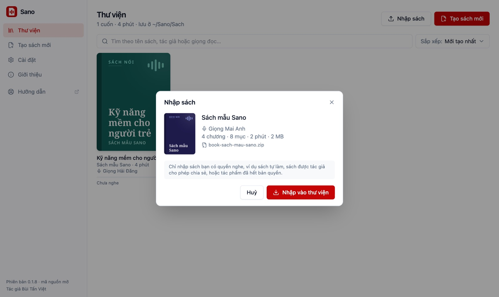
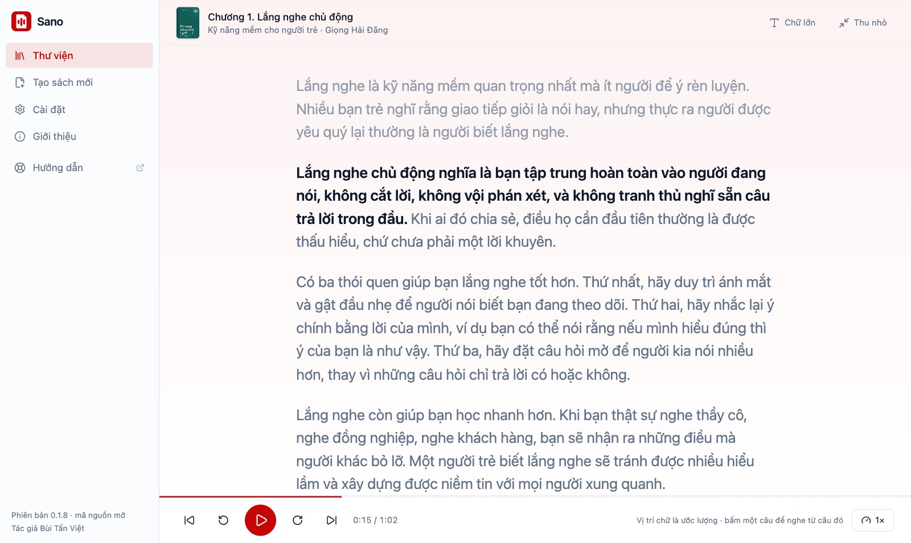

# Thư viện & danh mục

Mọi cuốn sách nói bạn tạo bằng Sano nằm trong **Thư viện**. Đầu trang cho biết số cuốn, tổng thời lượng và nơi lưu (`~/Sano/Sach`, bấm vào để mở thư mục).

Lần đầu mở Sano, thư viện có sẵn 3 cuốn mẫu để bạn nghe thử ngay khi chưa tạo cuốn nào: **Giới thiệu Sano** (3 phút, giọng Thiện Minh), **Nghe Để Nhớ** (12 phút, giọng Hải Đăng) và **Tiệm Cà Phê Thứ Hai** (18 phút, giọng Mỹ Duyên). Không cần thì xoá như sách thường, Sano không tự thêm lại.

## Nghe tiếp và tất cả sách

- Hàng **Nghe tiếp** hiện tối đa 3 cuốn đang nghe dở, bấm là phát tiếp.
- Mục **Tất cả sách** hiện bìa từng cuốn kèm tên, tác giả, thời lượng, **giọng đọc** và tiến độ: "Chưa nghe", "Đã nghe X%" hoặc "Đã nghe xong". Các tập của cùng một [bộ sách](#bo-sach-nhieu-tap-tu-0-1-11) gom thành một thẻ.

## Tìm và sắp xếp

- Ô **Tìm theo tên sách, tác giả hoặc giọng đọc…** tìm được cả khi gõ không dấu.
- **Sắp xếp:** Tự sắp xếp, Mới tạo nhất, Nghe gần đây, Tên A–Z, Tác giả A–Z, Dài nhất. Sano nhớ lựa chọn của bạn.

### Tự sắp xếp theo ý bạn (từ 0.1.11)

1. Bấm nút **Sắp xếp** bên phải dòng **Tất cả sách** (hoặc chọn **Tự sắp xếp** trong menu Sắp xếp).
2. Nhấn giữ một bìa, kéo tới chỗ muốn đặt rồi thả. Bìa ở chỗ sẽ thả có viền đỏ. Một bộ sách di chuyển như một thẻ.
3. Bấm **Xong** (hoặc phím Esc). Lỡ tay thì bấm **Về thứ tự cũ** trước khi bấm Xong.

Thứ tự được lưu lại, lần sau mở vẫn giữ nguyên. Sách mới tạo hoặc mới nhập nằm đầu kệ, bạn kéo về chỗ muốn đặt.

## Bộ sách nhiều tập (từ 0.1.11)

Sách có nhiều tập (tập 1, tập 2, tập 3…) thì gom thành một **bộ sách**, để cuốn khác không chen vào giữa các tập.

- **Đưa vào bộ:** ở bước Nạp file khi tạo sách, hoặc trong **Sửa thông tin** của cuốn đã có, chọn ô **Bộ sách** (hoặc bấm **Tạo bộ sách mới**) và điền **Tập số**. Sano tự điền số tập kế tiếp; trùng số tập với cuốn khác trong bộ thì Sano báo để bạn chọn lại.
- **Trên kệ:** cả bộ là một thẻ, bìa xếp chồng, có nhãn **Bộ N tập**. Bấm vào để mở trang bộ sách: các tập xếp theo số tập, nút **Nghe tiếp** mở đúng tập đang nghe dở.
- **Nghe hết một tập** thì Sano tự chuyển sang tập sau.
- Gói zip của mỗi tập mang theo tên bộ và số tập, nên nhập sang máy khác vẫn giữ đúng bộ.

## Danh mục

Danh mục là nhãn bạn tự đặt cho mỗi cuốn (tối đa 40 ký tự), dùng để lọc thư viện.

- **Gắn danh mục:** chọn ở bước Nạp file khi tạo sách, hoặc trong **Sửa thông tin** của cuốn đã có. Chưa có danh mục phù hợp thì bấm **Tạo danh mục mới**, gõ tên rồi bấm **Thêm**.
- **Lọc:** khi thư viện có từ 2 danh mục, phía trên lưới bìa hiện các nút lọc: Tất cả, Đang nghe, từng danh mục, Chưa phân loại.
- Danh mục tự biến mất khi không còn cuốn nào dùng. Muốn đổi danh mục của một cuốn thì sửa thông tin cuốn đó.

### Quản lý danh mục và bộ sách (từ 0.1.11)

Bấm **Quản lý danh mục, bộ sách** cạnh các nút lọc:

- **Đổi tên:** áp cho mọi cuốn cùng lúc. Đổi trùng tên một danh mục đã có thì hai danh mục gộp làm một.
- **Xoá:** sách vẫn giữ nguyên. Xoá danh mục thì các cuốn về "Chưa phân loại"; xoá bộ sách thì các tập tách ra thành sách lẻ.

## Nhập sách từ gói zip

Người khác gửi cho bạn gói sách (`book-<tên-sách>.zip`, tạo bằng nút **Xuất gói zip**), hoặc bạn muốn lấy lại bản sao lưu: bấm **Nhập sách** ở đầu Thư viện rồi chọn file, hoặc kéo thả file `.zip` vào cửa sổ.

- Sano cho **xem trước** bìa, tên, giọng đọc, số chương, thời lượng, rồi mới nhập. Sách nhập giữ đủ mục lục, bìa, tên giọng và chữ chạy theo.
- **Trùng sách đã có:** chọn **Giữ cả hai** (cuốn mới tên "… (2)") hoặc **Thay thế** (cuốn cũ vào Thùng rác, lấy lại được).
- Gói lạ, bị sửa hay hỏng bị từ chối, Sano nói rõ lý do và không thêm gì vào thư viện. Chi tiết ở [Xuất M4B & gói zip](./xuat-m4b-goi-zip#nhap-goi-zip-tu-0-1-8).
- Chỉ nhập sách bạn có quyền nghe.

## Sửa thông tin, mở thư mục, xoá

Bấm nút **⋯** trên bìa sách:

- **Sửa thông tin**: đổi **Tên sách**, **Tác giả**, **Danh mục**, **Bộ sách** và **Tập số**. Chỉ đổi phần hiển thị và gói zip; lời mở đầu đã đọc giữ nguyên, muốn đọc tên mới thì tạo lại sách.
- **Mở thư mục**: mở thư mục chứa file của cuốn sách.
- **Chuyển vào Thùng rác**: Sano hỏi lại rồi chuyển cả thư mục sách vào Thùng rác của máy, lấy lại được nếu xoá nhầm.

## Trình phát

Bấm vào một cuốn để nghe ngay trong Sano:

- Phát, dừng, lùi 15 giây, tới 30 giây, mục trước, mục sau; bấm vào thanh tiến độ để nhảy tới chỗ bất kỳ.
- Tốc độ 0,75× đến 2×, Sano nhớ tốc độ bạn chọn.
- Tự nhớ chỗ nghe dở của từng cuốn, hết mục tự sang mục kế.
- Cột **Mục lục** liệt kê từng mục và tự cuộn tới mục đang phát, bấm để nhảy tới.
- **Rời màn nghe vẫn nghe tiếp:** sang Thư viện, Tạo sách hay Cài đặt, sách phát tiếp ở **thanh nghe nhỏ** dưới đáy cửa sổ (phát/dừng, tua, ✕ để dừng hẳn). Bấm tên sách trên thanh để mở lại màn nghe. Khi bấm **Nghe mẫu** giọng lúc tạo sách, sách tự tạm dừng.
- Hàng nút: **Xuất M4B**, **Xuất gói zip**, **Mở thư mục**, **Xoá**.

### Chữ chạy theo lời đọc

Ô **Lời đọc** dưới tên mục hiện câu đang đọc và câu kế. Bấm vào để mở **Xem lời**: chữ lớn như trong file Word, câu đang đọc in đậm, tự cuộn theo.

- Bấm một câu để nghe từ câu đó. Tự cuộn đi chỗ khác thì Sano ngừng bám theo, bấm **Về câu đang đọc** để quay lại.
- **Chữ lớn** phóng to chữ, **Thu nhỏ** về màn nghe.
- Vị trí chữ là **ước lượng** theo độ dài câu rồi khớp vào khoảng ngừng thật trong giọng đọc, thường lệch dưới nửa giây. Dùng được cho cả sách đã tạo trước đây.
- Tiện để soát: nghe thấy chỗ đọc sai là biết ngay câu nào, sửa lời đọc rồi tạo lại sách.

## Sách lưu ở đâu

Mỗi cuốn là một thư mục trong `~/Sano/Sach/<tên-sách>/`:

| File | Là gì |
|---|---|
| `ch01-sec01.mp3`, `ch02-sec01.mp3`… | Audio từng mục (`ch01-sec01` là lời mở đầu) |
| `ch01-sec01.txt`… | Lời đọc đúng như bộ đọc đã đọc, để soát lại khi cần |
| `cover.png` (hoặc ảnh bìa bạn chọn) | Bìa sách |
| `metadata.json` | Tên sách, tác giả, danh mục, bộ sách và số tập, mục lục |
| `book-<tên-sách>.zip` | Gói zip của cả cuốn, dùng để sao lưu |

Thứ tự **Tự sắp xếp** lưu ở file `~/Sano/.thu-tu.json` (cạnh thư mục `Sach`).

Sách chỉ nằm trên máy bạn. Sao lưu thư mục `~/Sano` là giữ được toàn bộ thư viện, kể cả thứ tự bạn đã sắp xếp.
