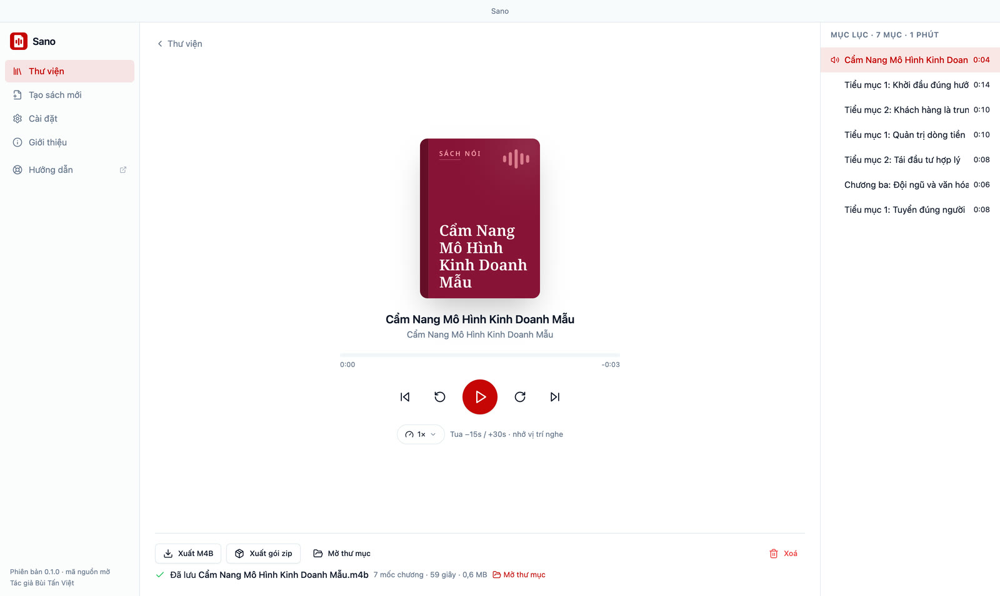

# Xuất M4B và gói zip

Sano có hai cách mang sách ra khỏi phần mềm: **file M4B** để nghe ở nơi khác, và **gói zip** để sao lưu.

## Xuất file M4B

M4B là định dạng sách nói chuẩn: **một file duy nhất** chứa cả cuốn, có mục lục chương, tên sách, tác giả và ảnh bìa. App sách nói trên điện thoại và màn hình xe (CarPlay, Android Auto) đọc được.

1. Mở cuốn sách trong Thư viện → bấm **Xuất M4B** (hoặc **Xuất file M4B** ngay khi render xong).
2. Chọn nơi lưu. Mặc định là thư mục Tải về, tên file là tên sách.
3. Sano xuất chạy nền, hiện phần trăm, bấm **Huỷ** được (không để lại file dở).
4. Xong, Sano mở thư mục và chọn sẵn file.



Dung lượng khoảng **29 MB cho mỗi giờ nghe** (AAC 64 kbps mono, đủ rõ cho giọng đọc). Mỗi lúc xuất một cuốn.

Tiếp theo: [chép file M4B sang điện thoại](./nghe-tren-dien-thoai).

::: tip File M4B mẫu
Muốn xem file M4B do Sano tạo trông thế nào trước khi cài? Bản phát hành trên [GitHub Releases](https://github.com/tanviet12/sano-sach-noi/releases/latest) kèm file M4B mẫu của sách "Kỹ năng mềm cho người trẻ" (khoảng 4 phút 30 giây, giọng Thiện Minh).
:::

## Gói zip

Mỗi cuốn sách có sẵn một file `book-<tên-sách>.zip` trong thư mục của nó: gồm audio từng mục, bìa và thông tin sách. Bấm **Xuất gói zip** (trong trình phát hoặc ngay khi render xong), Sano mở trình quản lý file và chọn sẵn file zip đó để bạn chép đi sao lưu.

Phiên bản hiện tại chưa có nút nhập gói zip vào Sano. Muốn chuyển cả thư viện sang máy khác, chép nguyên thư mục `~/Sano/Sach` sang cùng vị trí trên máy mới. Cấu trúc gói zip ghi ở [Định dạng gói zip](./book-zip-format).

## Dùng dòng lệnh

Công cụ dòng lệnh `sano-docx2tts` (trong mã nguồn) xuất M4B từ một thư mục sách đã tạo:

```bash
sano-docx2tts --m4b-from-dir ~/Sano/Sach/<tên-sách> --m4b ~/Downloads/sach.m4b
```

Muốn file nhỏ hơn thì thêm `--m4b-bitrate 48k`. Chi tiết ở [Đọc giọng bằng dòng lệnh](./tts-build-guide).
